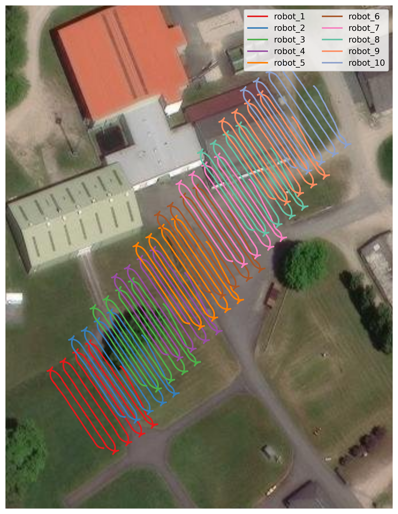

# ROS 2 Robot Fleet Demo

Simulate a fleet of N robots publishing sensor data to **Apache Kafka** or **MQTT**.
Each robot replays a ROS 2 bag and has its own private sink (edge topology).



## Prerequisites

- Docker Engine ≥ 24 with Compose v2
- A ROS 2 bag directory (see conversion below if you have a ROS 1 `.bag`)

### Convert a ROS 1 bag (one-time)

**Option A — Docker (no local Python needed):**

```bash
./convert_bag.sh my_recording.bag
# → bags/my_recording_ros2/
```

**Option B — manual (requires `pip install rosbags`):**

```bash
pip install rosbags
rosbags-convert \
    --src my_recording.bag \
    --dst bags/my_recording_ros2 \
    --dst-version 8 --dst-typestore ros2_humble
```

## Quickstart

```bash
# 10 robots → Kafka
N=10 BROKER=kafka BAG_PATH=/tmp/my_bag_ros2 ./run.sh

# 5 robots → MQTT
N=5 BROKER=mqtt BAG_PATH=/tmp/my_bag_ros2 ./run.sh

# 5 robots, each with its own Mosquitto broker (edge simulation)
TOPOLOGY=per-robot N=5 BROKER=mqtt BAG_PATH=/tmp/my_bag_ros2 ./run.sh

# Start fleet and sample one decoded message every 10 s (Ctrl+C to stop)
N=3 BROKER=mqtt PAYLOAD_FORMAT=json BAG_PATH=/tmp/my_bag_ros2 ./run.sh --echo

# Stop the fleet
./run.sh --stop
```

## Topic naming

| Transport | Pattern | Example |
|-----------|---------|---------|
| Kafka | `ros2.robot_<id>.<suffix>` | `ros2.robot_3.gnss` |
| MQTT  | `ros2/robot_<id>/<suffix>` | `ros2/robot_3/gnss` |

| Suffix   | ROS 2 type                       | Rate    |
|----------|----------------------------------|---------|
| `gnss`   | `sensor_msgs/msg/NavSatFix`      | 10 Hz   |
| `odom`   | `nav_msgs/msg/Odometry`          | 20 Hz   |
| `scan`   | `sensor_msgs/msg/LaserScan`      | 50 Hz   |
| `points` | `sensor_msgs/msg/PointCloud2`    | 12.5 Hz |

Payloads are **CDR-serialized** by default for MQTT and **JSON-serialized**
by default for Kafka. The `header.stamp` field carries the publish wall-clock
time (`t0_ns = sec×10⁹ + nanosec`).

## Payload format

The serialization format is controlled by the `PAYLOAD_FORMAT` environment variable:

| Value | Description |
|-------|-------------|
| `cdr` | Binary CDR (default for MQTT) |
| `json` | JSON (default for Kafka) |

```bash
# MQTT with JSON payloads
PAYLOAD_FORMAT=json N=5 BROKER=mqtt BAG_PATH=/path/to/bag ./run.sh

# Kafka with CDR payloads
PAYLOAD_FORMAT=cdr N=10 BROKER=kafka BAG_PATH=/path/to/bag ./run.sh
```

JSON payloads use field names from the ROS 2 message definition and support
all four message types (`NavSatFix`, `Odometry`, `LaserScan`, `PointCloud2`).
Infinite/NaN float values (e.g. out-of-range laser returns) are serialized as
`null`.

## Topology

The `TOPOLOGY` environment variable selects how brokers are allocated:

| Value | Description |
|-------|-------------|
| `shared` (default) | All robots write to one broker |
| `per-robot` | Each robot gets its own broker (MQTT only) |

```bash
# Shared broker (default)
N=10 BROKER=mqtt BAG_PATH=/path/to/bag ./run.sh

# Per-robot brokers: robot 1 → :1883, robot 2 → :1884, …
TOPOLOGY=per-robot N=5 BROKER=mqtt BAG_PATH=/path/to/bag ./run.sh

# Stop
TOPOLOGY=per-robot N=5 BROKER=mqtt ./run.sh --stop
```

In `per-robot` mode each robot's `header.frame_id` is set to `robot_<id>`
so consumers can identify the source robot per message.

## Manual 3-stage startup

Use `--stage` when you need a downstream consumer (Nebula, ksqlDB, custom)
to be running *before* robots start publishing — otherwise the consumer
may miss the first messages.

```bash
# 1. Brokers only (BAG_PATH not required at this stage)
N=5 BROKER=mqtt TOPOLOGY=per-robot ./run.sh --stage brokers

# 2. Start your downstream consumer here (subscribe to the brokers)

# 3. Robots (dispatcher + ROS publisher in each container)
N=5 BROKER=mqtt TOPOLOGY=per-robot BAG_PATH=/path/to/bag ./run.sh --stage robots

# Tear down
N=5 BROKER=mqtt TOPOLOGY=per-robot ./run.sh --stop
```

The default `./run.sh` (no `--stage`) runs both stages back-to-back, same as before.

## Live message echo

Add `--echo` to start the fleet and immediately begin printing one decoded message
every 10 seconds — useful for a quick sanity-check without a separate terminal:

```bash
N=3 BROKER=mqtt PAYLOAD_FORMAT=json BAG_PATH=/path/to/bag ./run.sh --echo
```

Output after fleet startup:

```
[echo] Sampling live messages every 10s ... (Ctrl+C to stop)

--- 16:08:13 ---
[robot_  3]  scan        1.4 ms     9.7 KB  ← ros2/robot_3/scan

--- 16:08:24 ---
[robot_  1]  odom        1.1 ms     1.0 KB  ← ros2/robot_1/odom
```

Each line shows: robot ID, topic type, end-to-end latency, payload size, and full topic path.
Ctrl+C stops the echo loop **and** keeps the fleet running. Use `./run.sh --stop` to tear down.

## Demo consumer

**Option A — Docker (no local ROS 2 needed):**

```bash
# Build once
docker build -t ros2-fleet-consumer -f consumer/Dockerfile .

# Kafka
docker run --rm --network host ros2-fleet-consumer --broker kafka

# MQTT
docker run --rm --network host ros2-fleet-consumer --broker mqtt

# Stats only
docker run --rm --network host ros2-fleet-consumer --broker kafka --stats-only

# Specific robots
docker run --rm --network host ros2-fleet-consumer --broker kafka --robots 1,3,5
```

**Option B — local Python (requires ROS 2 Humble):**

```bash
cd consumer
pip install -r requirements.txt

python consume.py --broker kafka
python consume.py --broker mqtt --stats-only
```

Output example:
```
Listening on KAFKA... (Ctrl+C to stop)

[robot_  1]  gnss      1.2 ms    0.1 KB  ← ros2.robot_1.gnss
[robot_  2]  scan      0.9 ms   28.0 KB  ← ros2.robot_2.scan
[robot_  1]  odom      1.1 ms    0.3 KB  ← ros2.robot_1.odom
...
[stats]     925 msg/s   11340.2 KB/s  robots=10  total=55,500
```

## Images

Images are published to GHCR from the
[ros2_kafka_dispatcher](https://github.com/LRMPUT/ros2_kafka_dispatcher) repo:

| Image | Purpose |
|-------|---------|
| `ghcr.io/lrmput/ros2-kafka-dispatcher:latest` | Dispatcher (kafka_sink / mosquitto_sink) + robot publisher |

### Build locally (alternative)

```bash
# From the ros2_kafka_dispatcher repo root:
docker build -f docker/Dockerfile --build-arg ROS_DISTRO=humble \
    -t ghcr.io/lrmput/ros2-kafka-dispatcher:latest .
```

## Using the INRAE field campaign bag

The demo was developed using a real ROS 1 bag from a leader/follower
agricultural campaign at INRAE Clermont-Ferrand.

**Download:** [Google Drive (~345 MB)](https://drive.google.com/drive/folders/1ZtEteOZKS7RpE3ClVaJJBrmUmUiiYYma?usp=sharing)

```bash
# 1. Convert (one-time, ~2 min)
./convert_bag.sh rorbots_follower_leader_parcelle_1MONT.bag
# → bags/rorbots_follower_leader_parcelle_1MONT_ros2/

# 2. Run 10 robots → Kafka
./examples/inrae_field_campaign.sh kafka 10

# 3. Live consumer (second terminal)
docker run --rm --network host ros2-fleet-consumer --broker kafka --stats-only
```

The bag contains NavSatFix, Odometry, LaserScan and PointCloud2 topics.
`robot_replay.py` selects topics **by message type**, not by name, so it
works with any bag that has those four ROS 2 types.
Each simulated robot gets its GPS position shifted **~6 m perpendicular to the field's
travel direction** (computed via PCA on the bag trajectory), so the 10 robots form
non-crossing parallel tracks centred around the original route.

## Trajectory recording and plotting

Record GNSS data flowing through the live Kafka or MQTT pipeline, then plot
each robot's path on a satellite map.

### 1. Start a fleet

```bash
N=10 BROKER=mqtt BAG_PATH=/path/to/bag ./run.sh
# or
N=10 BROKER=kafka BAG_PATH=/path/to/bag ./run.sh
```

### 2. Record GNSS from the pipeline

```bash
pip install pandas geopandas folium contextily matplotlib paho-mqtt confluent-kafka

# MQTT fleet
python3 tools/record_gnss.py --broker mqtt --robots 1-10 --out trajectories/ --duration 120

# Kafka fleet
python3 tools/record_gnss.py --broker kafka --robots 1-10 --out trajectories/ --duration 120
```

Writes one `robot_N_gnss.txt` file per robot (`timestamp_ns / latitude / longitude / altitude`).
Auto-detects JSON and CDR payloads from the broker headers.

### 3. Plot trajectories

```bash
python3 tools/plot_trajectories.py trajectories/
```

Outputs:
- `trajectories.html` — interactive Leaflet map (open in browser)
- `trajectories.png` — 500 dpi satellite map (Esri WorldImagery)
- `trajectories.pdf` — vector version for publications

## Latency capture

Record per-message end-to-end latency (ROS publish → broker → consumer) to
JSONL and summarize it. Latency is `t1_ns − header.stamp`, where each robot
stamps `header.stamp = time.time_ns()` at publish time.

```bash
# 0. Build the consumer image once
docker build -t ros2-fleet-consumer consumer/

# 1. Run a 60 s capture with 10 robots on Kafka
BAG_PATH=bags/rorbots_follower_leader_parcelle_1MONT_ros2 \
    N=10 BROKER=kafka DURATION=60 ./tools/run_latency_capture.sh

# 2. Analyze the artifacts the run prints the path to
python3 tools/analyze_latency.py latency_artifacts/<run>/
```

Artifacts written to `latency_artifacts/<timestamp>/`:

| File | Contents |
|------|----------|
| `consumer.jsonl` | one record per received message: `robot_id, suffix, topic, t0_ns, t1_ns, latency_ns, payload_bytes` |
| `publisher/publisher_robot_<id>.jsonl` | one record per published message: `robot_id, suffix, topic, t0_ns` |

`analyze_latency.py` joins the two sides on the `(robot_id, suffix, t0_ns)`
set — so MQTT QoS-1 duplicate deliveries do not inflate the match count — and
prints per-stream p50/p95/p99/max latency, throughput, and drop rate.

The orchestrator runs the 3-stage flow (brokers → consumer → robots) so the
consumer never misses early messages, captures for `DURATION` seconds, then
tears the fleet down (also on Ctrl+C).

## Decoding CDR in Python

```python
from rclpy.serialization import deserialize_message
from sensor_msgs.msg import NavSatFix

# raw_bytes comes from Kafka/MQTT payload
msg = deserialize_message(raw_bytes, NavSatFix)
print(f"lat={msg.latitude:.6f}  lon={msg.longitude:.6f}  alt={msg.altitude:.1f}")
t0_ns = msg.header.stamp.sec * 1_000_000_000 + msg.header.stamp.nanosec
```
